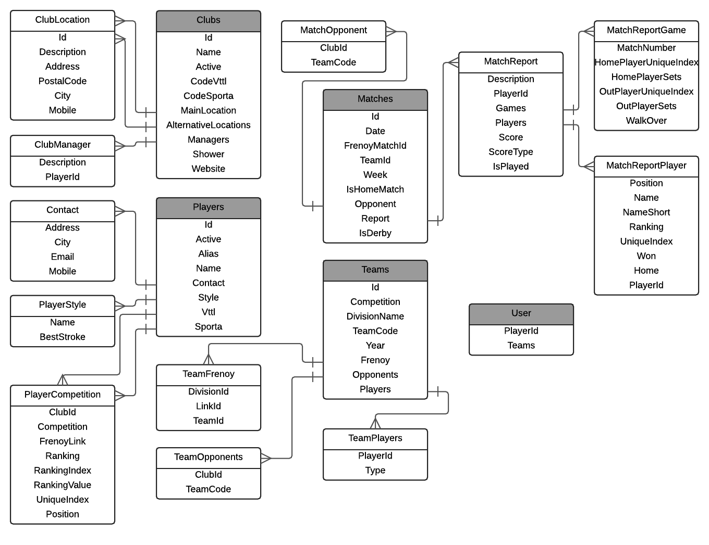

Front: React-Redux
==================

Oh boy:
- Need to fix all browserHistory for new react-router
- AutoComplete from '@material-ui/core/AutoComplete' replaced with react-select
- analytics is down
- matchcardheader -> cards also have different API now...
- full page loader is gone now

The port for the backend is atm hardcoded in:  
`src/utils/httpClient.js`

Database:  

```
docker run --name ttc-mysql -p 33060:3306 -e MYSQL_ROOT_PASSWORD=my-secret-pw -d mysql:5.5.60

create database ttc_erembodegem
-- and load some sql script
```


Template used:  
https://github.com/kriasoft/react-starter-kit

Diagram van Ttc.Model
---------------------
IEnumerables van Club, Team, Match en Player zijn de state aan de frontend.  
Links tussen deze zijn altijd via int clubId, playerId, etc

Polyfills
---------
`autopolyfiller app.js -b "safari 4, explorer 8" > polyfills.js`

Lucid Chart
-----------
https://www.lucidchart.com/invitations/accept/75107705-57fa-4359-831a-e4ba0289a0d4

Dit is het model zoals beschikbaar in de Redux store.  
(Grijs = this.state.xxx)  



Linters
-------
SublimeText3 Packages:  
- EditorConfig
- SublimeLinter
- SublimeLinter-contrib-eslint
- SublimeLinter-jscs

Globale NPM packages:  
- npm install --global eslint
- npm i -g babel-eslint
- npm i -g eslint-plugin-react


- npm i -g jscs
- npm i -g babel-core@^5.0.0
- npm i -g esprima-harmony-jscs

Experimental Features
---------------------
De decorators waren mss niet zo'n goed idee.
Ik wou naar Babel 6 upgraden maar de decorators bestaan daar niet meer.
(er is een legacy package maar vanaf dan beginnen de weird errors:)

In de originele template zijn de decorators er ook uit gehaald:  
https://github.com/kriasoft/react-starter-kit
